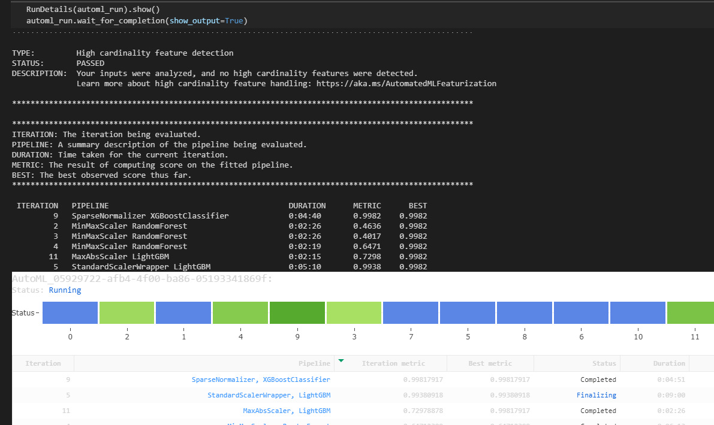
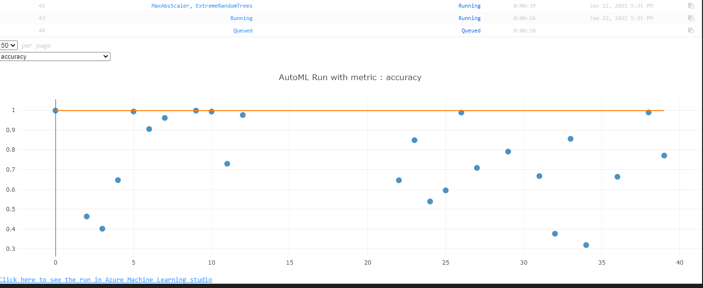
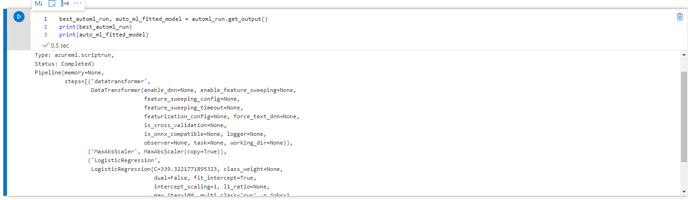
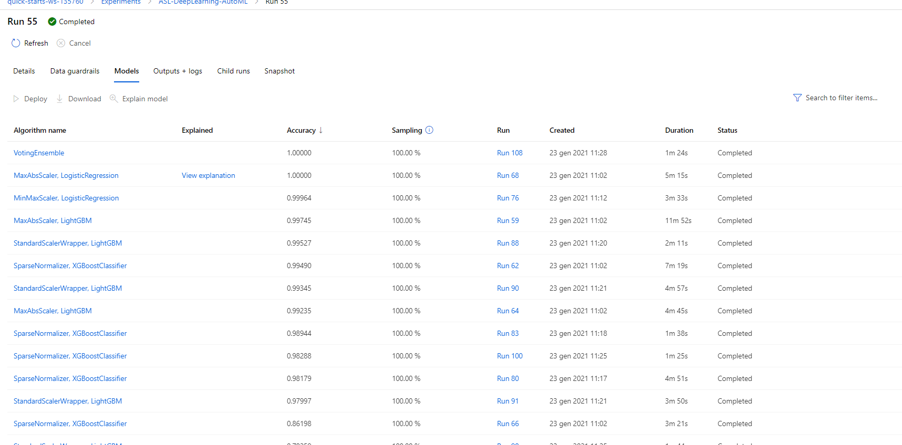
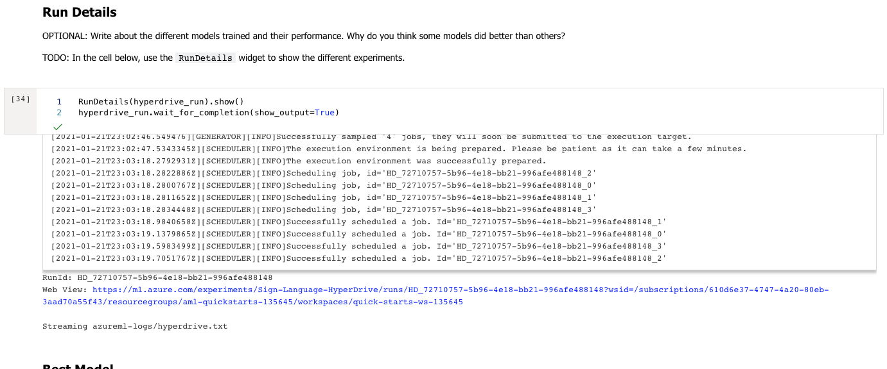
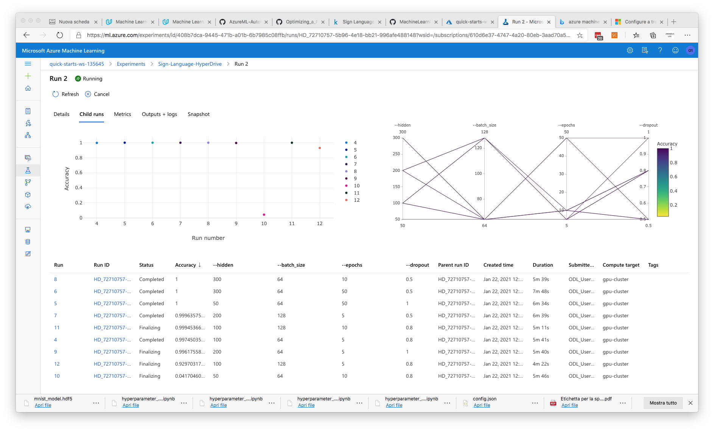
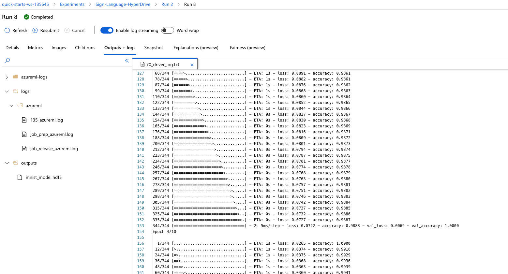

# American Sign Language Recognition with Deep Learning

Sign languages are a group a communication languages that use a combination of manual articulations in combination with non-manual elements to convey messages. There are different sign language with variability in hand shape, motion profile, and position of the hand, face, and body parts contributing to each sign. Each country generally has its own native sign language, and some have more than one: the current edition of [Ethnologue](https://www.ethnologue.com/subgroups/sign-language) lists 144 sign languages.

The simplest class of sign languages, know as fingerspelling systems is limited to a collection of manual sign that representing the symbol of an alphabet. In this project we are going to create two different models to accomplish the letter/number gesture recognition task from static images. 

For the first model we will use Azure Automated ML (_AutoML_). We will also develop and train a second custom model with Kera/Tensorflow framework whose hyperparameters are tuned using  _HyperDrive_ from _Azure Machine Learning_. Then we will compare the performance of both the models and we will deploy the best performing model as web service using Azure ML SDK.


All steps are described in this document. A screencast that shows the processs and the final working ML application is provided together with Jupyter notebooks, Python scripts and trained model. 

## Table Of Contents

- [American Sign Language Recognition with Deep Learning](#american-sign-language-recognition-with-deep-learning)
    - [The Sign Language Recognition Problem](#the-sign-language-recognition-problem)
  - [Table Of Contents](#table-of-contents)
  - [Project Workflow](#project-workflow)
  - [Project Set Up and Installation](#project-set-up-and-installation)
  - [Dataset](#dataset)
    - [Overview](#overview)
    - [Task](#task)
    - [Access](#access)
  - [Automated ML](#automated-ml)
    - [Results](#results)
  - [Hyperparameter Tuning](#hyperparameter-tuning)
    - [Results](#results-1)
  - [Model Deployment](#model-deployment)
  - [Screen Recording](#screen-recording)
  - [Standout Suggestions](#standout-suggestions)


## Project Set Up and Installation
To run this project you will need an Azure ML workspace.
The provided Jupyter notebooks can be executed in local development environment with _AzureML SDK installed_ or uploaded in _Azure Machine Learning Studio_ and executed in a remote compute instance. For model training a remote compute cluster in _Azure ML_  is used.

The following libraries must be installed in the development environment:

- Numpy and Pandas — for data handling and processing
- SciKitLearn, TensorFlow , Kera— for machine learning functions
- Matplotlib — for data visualization
- Azure ML SDK

Run the following install get all required libraries:


```bash
pip install azureml-sdk
pip install azureml-sdk[notebooks]
pip install tensorflow
pip install keras
pip install matplotlib
```

###  Run from Visual Studio Code

To run the notebook from Visual Studio Code you can install the following extensions:

- Azure Machine Learning (ms-toolsai.vscode-ai)
- Jupyter (ms-toolsai.jupyter) 

## Dataset
The [American Sign Language MNIST Dataset from Kaggle](https://www.kaggle.com/datamunge/sign-language-mnist) is used for this project. A copy of the dataset is included into [Datasets](./datasets) folder of the the repository. The dataset is made by two distinct collection of gray scale image:

- **sign_mnist_train**: for model training and validation
- **sing_mnist_test**: for model testing. (Never used during model training, tuning and validation process)


### Dataset format

This dataset is in tabular format and is similar to the [original MNIST dataset]([MNIST Original | Kaggle](https://www.kaggle.com/avnishnish/mnist-original)). Each row in the csv file represents a label and a single 28x28 pixel greyscale image represented using 784 pixel values ranging from 0-255.

The label in the dataset is a number ranging from 0-25 associated with its english letter equivalent (e.g. 0 = a)

There is no label correspondence to the letter J (9) and Z (25) due to the motion required to symbolize those letters. 

In total there are 27,455 training cases and 7,172 tests cases in this dataset.


### The Sign Language Recognition Task
The general sign language recognition problem  include three different tasks:

1. static o continuous letter/number gesture recognition (classification problem)
2. static or continuous single word recognition (classification problem)
3. sentence level sign language recognition (Natural Language Processing problem)

In this demo project we are going to create two different models to accomplish the letter/number gesture recognition task from static images. 


### Data Access
The dataset is uploaded into the the workspace creating a _tabular dataset_ from the original CSV file using _TabularDatasetFactory_ class and registered as  "sign-language-mnist".  Dataset is then converted to a _Pandas dataframe_ for every subsegment usage.

```python
found = False
key = "sign-language-mnist"
description_text = "sign Language MNIST"

if key in ws.datasets.keys(): 
    found = True
    ds = ws.datasets[key] 

if not found:
    from azureml.data.dataset_factory import TabularDatasetFactory
    datastore_path = "https://github.com/emanbuc/ASL-Recognition-Deep-Learning/raw/main/datasets/sign-language-mnist/sign_mnist_train/sign_mnist_train.csv"
    ds = TabularDatasetFactory.from_delimited_files(path=datastore_path,header=True)       
    #Register Dataset in Workspace
    ds = ds.register(workspace=ws,name=key,description=description_text)

df = ds.to_pandas_dataframe()
```

## Automated ML
The *AutoML* configuration has tuned in order to be compatible with the 2 hour timeout limit we have for the lab. 

For the training dataset we are using the _AutoML_ requires an experiment timeout greater than 1 hour.  A 1.1 hour value was used together with *iteration_timeout_minutes* and *enable_early_stopping* to control the duration of the experiment.

To assure that only models compatible with ONNY are used _enable_onnx_compatible_models_ is set to True .

```python
automl_settings = {

  "experiment_timeout_hours" : 1.1,

  "enable_early_stopping" : True,

  "iteration_timeout_minutes": 10,

  "max_concurrent_iterations": 10,

  "enable_onnx_compatible_models": True
}
```
_Accuracy_ (ratio of predictions that exactly match the true class labels) is selected as primary metric for model scoring and the a remote compute cluster (up to 10 node, GPU based ) is selected as computation target.  _AmlCompute clusters_ support one interation running per node so  "max_concurrent_iterations" is set to 10 to match the cluster capacity.

```python
 automl_config = AutoMLConfig(

  debug_log='automl_errors.log',

  compute_target=gpu_cluster,

  task='classification',

  primary_metric='accuracy',

  training_data= ds,

  label_column_name='label',

  **automl_settings) 
```

### Results
The AutoML run generated many different models with good performance. Some of them achieve 100% accuracy score. The proges of the run can monitored from Rundetails Widget (both from web interface and from local SDK)







The best performing model is a simple "Logistic Regression"  with a 100% accuracy score. The [trained model](./models/AutoMLcd06aae969_run55.zip) is provided in the models folder. The full list of the model is compiled as the run finished.  





## Hyperparameter Tuning
*TODO*: What kind of model did you choose for this experiment and why? Give an overview of the types of parameters and their ranges used for the hyperparameter search

The custom model was created with Keras using a common deep learning CNN architecture for image recognition task.  The model training script take some parameters as input that can be used for hyper-parameters tuning.

### Model

```python
input_shape = (28,28, 1) # 28*28 = 784

model = keras.Sequential()

model.add(Conv2D(28, kernel_size=(3,3), input_shape=input_shape))

model.add(MaxPooling2D(pool_size=(2, 2)))

model.add(Flatten()) # Flattening the 2D arrays for fully connected layers

model.add(Dense(args.hidden, activation=tf.nn.relu))

if args.dropout is not None and args.dropout<1:

  model.add(Dropout(args.dropout))

model.add(Dense(y_train.shape[1],activation=tf.nn.softmax))
```

### Hyperparameter  Config

For Hyperparameter experiment we have to stay into total 2 hours lab timeout limit so only a limited number of run was possible.

In order to assure a quick execution time the _choice_ sampling method is used. Also a A *MedianStoppingPolicy* is added as termination policy together with  *max_total_runs* limit of 50. A remote GPU *AmlCluster* with 10 node is used as compute target and the *max_concurrent_runs* parameter match the cluster capacity.

```python
param_sampling = RandomParameterSampling({

​     '--hidden': choice([50,100,200,300]),

​     '--batch_size': choice([64,128]), 

​     '--epochs': choice([3,5,10]),

​     '--dropout': choice([0.5,0.8,1])})
```

### Results
*TODO*: What are the results you got with your model? What were the parameters of the model? How could you have improved it?

The tuning process can be monitored with RunDetails widget



After Hyperparameters tuning found many parameters configuration that achieve 100% accuracy on validation dataset.




.


## Model Deployment
*TODO*: Give an overview of the deployed model and instructions on how to query the endpoint with a sample input.

Other run of AutoML experiment produced different and more complex model. The logistic regression model has a better score and perform well also with testing data  .... 


## Screen Recording
*TODO* Provide a link to a screen recording of the project in action. Remember that the screencast should demonstrate:
- A working model
- Demo of the deployed  model
- Demo of a sample request sent to the endpoint and its response

## Standout Suggestions
*TODO (Optional):* This is where you can provide information about any standout suggestions that you have attempted.

- Use [Dataset Monitor](https://docs.microsoft.com/en-us/azure/machine-learning/how-to-monitor-datasets?tabs=python) to detect data drift
- Publish a pipeline for automatic model re-training
- 

